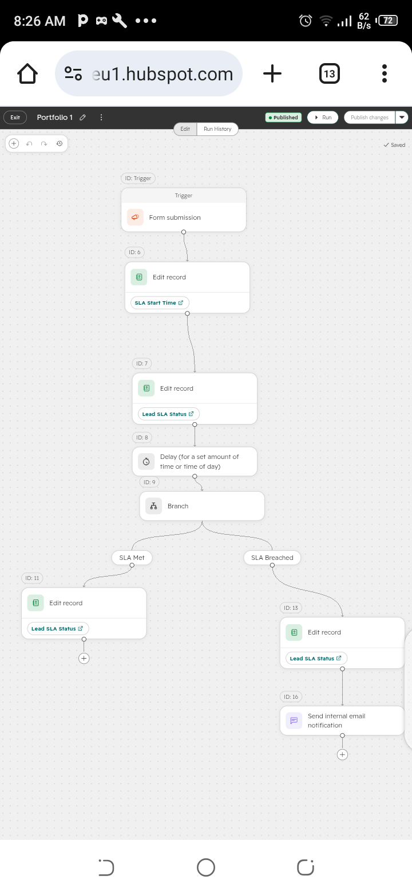

# HubSpot Automated 15-Minute Lead Routing & SLA Engine

## 📌 Executive Summary
Designed and deployed an automated inbound lead distribution system in HubSpot to enforce a 15-minute response SLA, eliminate manual lead triage, and provide sales leadership with real-time breach visibility.

---

## 🏗️ Technical Architecture & Data Schema

### Custom Properties
* `Lead SLA Status` (Enumeration): Tracks SLA compliance (`Met` vs. `Breached`).
* `SLA Start Time` (Date & Time): Logged automatically upon lead assignment.

### Workflow Routing Logic
1. **Trigger:** Inbound form submission / Lead creation.
2. **Assignment:** Automated Round-Robin distribution to sales representatives.
3. **SLA Timer:** 15-minute delay step.
4. **Conditional Branching:** Checks for recorded contact activities (logged calls, sent emails).
5. **Escalation Path:** Updates `Lead SLA Status` to `Breached` if unserviced and triggers internal manager notifications.

---

## 📊 Executive Reporting & Dashboarding

* **Dashboard Name:** `RevOps: SLA & Lead Routing Engine`
* **Macro Metric:** `SLA Compliance Breakdown` (Donut Chart displaying proportion of Met vs. Breached SLAs).
* **Operational Queue:** `Unserviced SLA Breaches` (Unsummarized Table listing breached leads for immediate triage).

